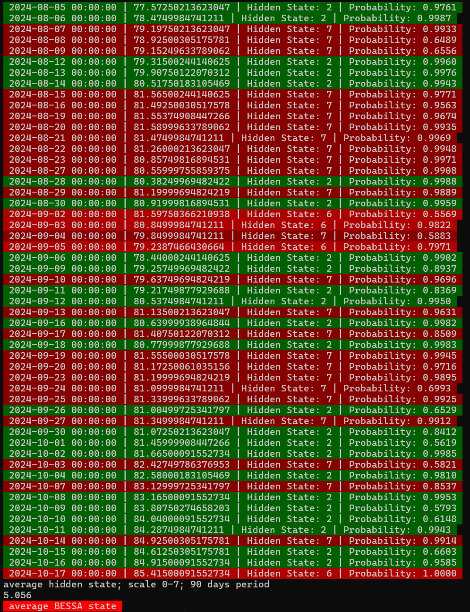

---

# Hidden Markov Model for Stock State Recognition

This project demonstrates the implementation and training of a **Hidden Markov Model (HMM)** for recognizing hidden states in stock market data, particularly using **yfinance** for fetching historical stock data. The model aims to classify stock market regimes (e.g., bull or bear markets) based on historical stock prices and indicators.

# How to use:
run dist/main/main.exe


## Disclaimer

**This program is extremely experimental. Use it at your own risk!** The accuracy of the predictions is not guaranteed, and the model is intended for research and educational purposes only. It is not suitable for making financial decisions.

## Table of Contents
- [Project Overview](#project-overview)
- [Dependencies](#dependencies)
- [Installation](#installation)
- [Usage](#usage)
- [Model Details](#model-details)
- [Code Overview](#code-overview)
- [Acknowledgments](#acknowledgments)

## Project Overview

This project builds and trains a **Hidden Markov Model** using stock market data to predict hidden market states based on historical data. The HMM model is trained to recognize different states such as "BULL" (Hossa) and "BEAR" (Bessa) markets using various financial features like:
- Open, Close, High, Low prices
- Volume
- Percentage returns

The model uses the **hmmlearn** library to predict hidden states based on features and probabilities associated with the market data.

### Features:
- **Training on historical stock data:** Fetch historical stock prices using **yfinance** and use it to train the HMM.
- **Hidden state prediction:** After training, the model can predict the hidden state of the market over a given time period.
- **Visualization of states:** Display the predicted states with color coding and probabilities.
- **Support for 8 market states:** The model can classify up to 8 different market states, ranging from "BULL" to "BEAR" markets.
- **Dynamic background colors:** Green and red background colors represent "Hossa" and "Bessa" market states.

## Dependencies

The project uses several Python libraries. Below are the key dependencies:

- `yfinance`: For fetching historical stock data.
- `hmmlearn`: For training the Hidden Markov Model.
- `matplotlib`: For visualizing data and states.
- `pandas`: For handling dataframes.
- `numpy`: For numerical computations.
- `sqlite3`: For interacting with local SQLite databases (optional).
- `pickle`: For saving and loading trained models.

Install the dependencies by running:
```bash
pip install yfinance hmmlearn matplotlib pandas numpy
```

## Installation

1. **Clone the repository:**
   ```bash
   git clone https://github.com/your-username/hmm-stock-market.git
   cd hmm-stock-market
   ```

2. **Install the required Python libraries:**
   ```bash
   pip install -r requirements.txt
   ```

3. **Set up data and model:**
   - You can fetch data directly using the `yfinance` library by specifying stock tickers.
   - Use the included SQLite database or fetch data live.

4. **Train the HMM model:**
   After gathering your dataset, you can train the model using the Python script and save the model for later predictions.

## Usage

### Fetch Historical Stock Data

Use **yfinance** to fetch stock data for any stock ticker. Example fetching stock data for a ticker such as `AAPL` (Apple):
```python
import yfinance as yf

data = yf.download("AAPL", start="2020-01-01", end="2023-01-01")
```

### Train the HMM Model

Use the provided script to train the HMM model with stock data. The model can be trained to recognize hidden states like "BULL" or "BEAR":
```bash
python train_hmm.py
```

### Predict Hidden States

After training the model, you can use it to predict hidden states of the market based on new stock data:
```bash
python predict_states.py
```

### Visualize Hidden States

The output will show the predicted hidden states along with probabilities for each date, with color-coded background (green for "BULL" and red for "BEAR"):
```bash
python visualize_states.py
```

## Model Details

The model uses a **Gaussian Hidden Markov Model (G-HMM)** to learn the hidden states from the stock data. The states are predicted based on multivariate observations such as:
- Open price
- Close price
- High price
- Low price
- Volume
- Percentage returns

The model is trained to predict the market's hidden states, and each state is associated with a probability score indicating the likelihood of being in that state.

### Hidden State Colors:
- **Green (Hossa)**: Bullish market conditions.
- **Red (Bessa)**: Bearish market conditions.
- **Other states**: Intermediate states, represented by other colors.

## Code Overview

- **train_hmm.py**: Script for training the HMM model using historical stock data fetched from yfinance.
- **predict_states.py**: Script for predicting hidden states of the stock market using a pre-trained HMM model.
- **visualize_states.py**: Script for visualizing hidden states with colored background and probabilities.
- **model_save.pkl**: Pickle file for saving the trained HMM model for future use.
- **VUSA.L.db**: SQLite database containing historical stock data (optional).

## Acknowledgments

This project utilizes various open-source Python libraries such as **hmmlearn**, **yfinance**, and **pandas**. Special thanks to the contributors of these libraries.


---
